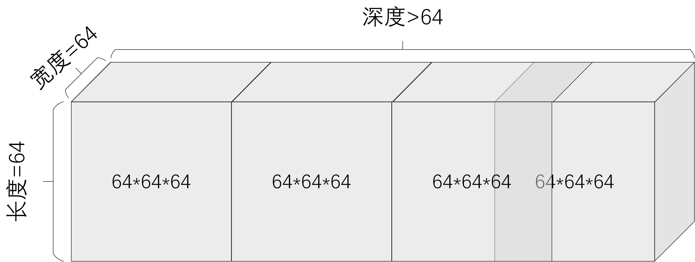

# Codes optimized for evaluating FROC

There are some tool codes listed below:

| Name                           | Function                                                     |
| ------------------------------ | ------------------------------------------------------------ |
| merge_img.py                   | Merge images in directory ./dataset-predicted into ./dataset-predicted-merged. |
| noreshape_only_change_label.py | Only change the label of ...label.nii.gz files and then store them in ./dataset-change-label-only directory. Attention: all of the tool codes change label first. |
| reshape_img.py                 | Change labels and then reshape them into 64$\times$64$\times$$X$ blocks. |
| split_img.py                   | Resize images in ribfrac-train or ribfrac-val(which are 512$\times$512$\times X$, and $X$ is larger than 64) into 64$\times$64$\times$$X$ blocks, and then split these blocks in order(like the one showed in below picture) and rename them.  The output directory is ./dataset64. |
| get_shape.py                   | To get the shape of $X$ in 512$\times$512$\times X$ of the images and then save them in shape.csv for the use of other functions. |

A typical process is like this:

- Run `python get_shape.py` to get the shape of images and labels in ribfrac dataset. This will generate shape.csv.
- Run `python split_img.py` to prepare the input data for predicting in ./dataset64. 
- Run `python train.py` to read a model that you have saved during previous training process and use it to predict the dataset under ./dataset64 directory. The output directory is ./dataset-predicted.
- Run `python merge_img.py` to merge the dataset in ./dataset-predicted into ./dataset-predicted-merged directory.
- Run `python reshape_img.py` to prepare the data in ./dataset-resize for comparing with the predicted data in ./dataset-predicted-merged.
- Analyze the dataset in ./dataset-predicted-merged and ./dataset-resize for FROC checking.

